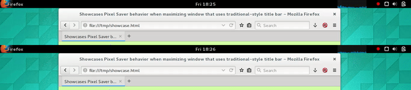
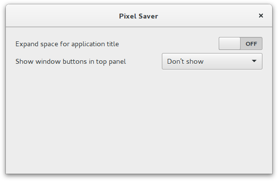

Pixel Saver
===========

Pixel Saver is a GNOME Shell extension that merges traditional-style title bars of maximized windows with the top panel to save screen real estate. This is especially useful on small screens, but more pixels for your applications is always a good thing!

For applications using the modern GTK header bar, there are
no space savings, but the application title is still displayed in the top panel to achieve a uniform appearance.

Installation
------------

Install it with one click from the [GNOME extension repository](https://extensions.gnome.org/extension/723/pixel-saver/).

### Dependencies

Pixel Saver depends on X, namely `xprop` and `xwininfo`. If not already present on your system, these can be installed using:

* Debian/Ubuntu: `apt install x11-utils`
* Fedora/RHEL: `dnf install xorg-x11-utils`
* Arch: `pacman -S xorg-xprop`

### Build from source

To install the most recent version manually, make sure `make` and
`xtgettext` are installed and follow the steps below:

    $ git clone https://github.com/deadalnix/pixel-saver.git
    $ cd pixel-saver
    $ git checkout -b 3.14
    $ make clean install

For code changes to become effective, you might need to reload GNOME Shell by pressing <kbd>Alt</kbd> + <kbd>F2</kbd> and entering <kbd>r</kbd> .

Configuration
-------------

To configure Pixel Saver it is recommended to use the provided GUI. Either via the
[GNOME Shell plugin](https://extensions.gnome.org/local/) in your browser, GNOME Tweak Tool (if installed)
or `gnome-shell-extension-prefs pixel-saver@deadalnix.me` from the command-line.

The following configuration options are available.

### Expand space for application title

Sets whether the available space for the application title in the top panel should be maximized. When enabled, this moves the clock to the right edge of the panel and uses all available space for the application title.

### Show window buttons in top panel

Sets whether and where window control buttons of maximized windows should be displayed in the top panel.

* **Before application name**  
	Display window buttons before the application name on the left
* **After application name**  
  Display window buttons after the application name on the left
* **Within system status area** (default)  
	Display window buttons within the system status area on the right
* **After system status area**  
  Display window buttons after the system status area on the right
* **Don't show**  
	Don't display window buttons in the top panel. You have to use the corresponding keyboard shortcuts

Acknowledgement
---------------

Pixel Saver is largely inspired by the [Window Buttons](https://github.com/mathematicalcoffee/Gnome-Shell-Window-Buttons-Extension)
and [Maximus](https://bitbucket.org/mathematicalcoffee/maximus-gnome-shell-extension) extensions
and utilizes code from both. A big thanks to their authors!
